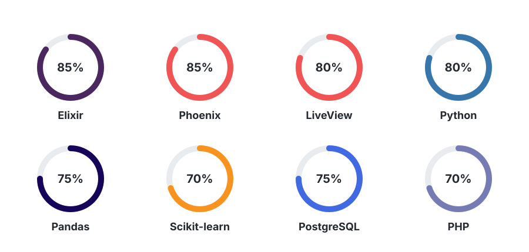

# 👋 Hi, I'm Fathan

### 💻 Backend & Full-Stack Developer

I'm a Computer Engineering student who enjoys building web applications,
exploring backend technologies, and working with data.

Currently exploring **Elixir, Phoenix, Phoenix LiveView, PostgreSQL, and MinIO**.

---

## 🛠️ Tech Stack

  

### 🤖 Data Science & Machine Learning

`Python` · `NumPy` · `Pandas` · `Scikit-learn` · `Matplotlib` · `Seaborn` · `Librosa` · `TSFEL`

### 🌐 Web Development

`Elixir` · `Phoenix` · `Phoenix LiveView` · `PHP` · `Laravel` · `HTML/CSS` · `Tailwind CSS`

### 🗄️ Database & Storage

`PostgreSQL` · `MySQL` · `Ecto` · `MinIO / S3`

### 🔧 Tools

`Git` · `GitHub` · `VS Code`

---

> Keep learning. Keep building.